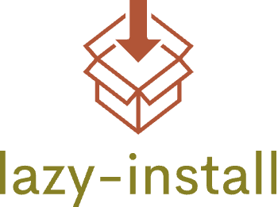

<p align="center">

</p>
<p align="center"> <a href="./README.md">English</a> | 简体中文</p>

当你想借助别的库来实现时，我需要经常复制库里面的使用案例，然后我还要再从命令行输入去安装这个依赖，我觉得有点麻烦了，我希望这个库能够监听到我的导入语句，在头部增加一个按钮，帮助我点击完直接安装依赖，这样我就不用再去复制粘贴了。

## Config
```json
{
  "configuration": {
    "type": "object",
    "title": "lazy-install",
    "properties": {
      "lazy-install.way": {
        "type": "string",
        "default": "ni",
        "description": "Choose how to install it, such as ni, npm, pnpm, yarn, default: ni"
      }
    }
  }
}
```

## :coffee:

[请我喝一杯咖啡](https://github.com/Simon-He95/sponsor)

## License

[MIT](./license)

## Sponsors

<p align="center">
  <a href="https://cdn.jsdelivr.net/gh/Simon-He95/sponsor/sponsors.svg">
    
  </a>
</p>
