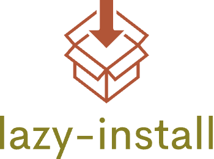

<p align="center">

</p>

<h1 align="center">🚀 Lazy Install</h1>

<p align="center">
  <strong>在 VS Code 中一键安装 import 缺失依赖的扩展</strong>
</p>

<p align="center">
  <a href="https://marketplace.visualstudio.com/items?itemName=simonhe.lazy-install">
    
  </a>
  <a href="https://marketplace.visualstudio.com/items?itemName=simonhe.lazy-install">
    
  </a>
  <a href="https://github.com/Simon-He95/lazy-install">
    
  </a>
</p>

<p align="center"> <a href="./README.md">English</a> | 简体中文</p>

<p align="center">
  Lazy Install 会在 JavaScript、TypeScript、React 和 Vue 文件中检测未安装依赖，并通过 npm、pnpm、yarn 或 ni 提供一键安装。
</p>

---

## ✨ 为什么在 VS Code 中使用 Lazy Install？

**告别繁琐的工作流程！** 🛑

❌ **以前**: 导入 → 复制包名 → 切换到终端 → 输入安装命令 → 等待 → 切回编辑器
✅ **现在**: 导入 → 点击安装按钮 → 完成！🎉

Lazy Install 会自动检测 `import`、`export from`、`require()` 和 `import()` 语句中的未安装包，并在编辑器内提供**一键安装按钮**。不用再切终端，也不用手动复制包名。

## 🎯 核心功能

- 🔍 **缺失依赖检测**: 自动扫描导入语句，找出尚未安装的依赖
- ⚡ **一键安装**: 通过 CodeLens 按钮即时安装 npm 包
- 🛠️ **多包管理器**: 支持 npm、pnpm、yarn 和 ni
- 🧩 **常见导入形式**: 支持 `import`、`export from`、`require()` 和 `import()`
- 📦 **开发依赖**: 可选择安装为正式依赖或开发依赖
- 🔧 **Monorepo 支持**: 支持 pnpm workspaces 和 `package.json` workspaces
- 🚀 **零配置**: 开箱即用，适用于 JavaScript、TypeScript、React 和 Vue 项目

*只需导入并点击 - 就这么简单！*

## 🚀 快速开始

1. **安装** 从 [VS Code 商店](https://marketplace.visualstudio.com/items?itemName=simonhe.lazy-install) 安装扩展
2. **编写** 一个缺失依赖的导入语句，例如 `import axios from 'axios'`
3. **点击** 导入语句上方出现的内联安装按钮
4. **完成！** 缺失依赖会被安装并立即可用

## ⚙️ 配置

在 VS Code 设置中自定义包管理器：

```json
{
  "lazy-install.way": "pnpm" // 选项: "ni", "npm", "pnpm", "yarn"
}
```

**支持的包管理器:**
- 🔧 **ni** (默认) - 通用包管理器
- 📦 **npm** - Node 包管理器
- ⚡ **pnpm** - 快速、节省磁盘空间
- 🧶 **yarn** - 可靠、安全、快速

## 🛠️ 支持的语言

- ✅ JavaScript (.js)
- ✅ TypeScript (.ts)
- ✅ React (.jsx, .tsx)
- ✅ Vue (.vue)

## 💡 使用技巧

- **正式依赖**: 点击包名按钮
- **开发依赖**: 点击 "包名 -D" 按钮
- **常见导入形式**: 支持 `import`、`require()` 和 `import()`
- **Monorepo**: 支持 pnpm workspaces 和 `package.json` workspaces

## ❓ 常见问题

### 支持 Monorepo 吗？

支持。扩展会识别 pnpm workspace 和 `package.json` workspaces，并优先在当前包目录执行安装，而不是固定在仓库根目录执行。

### 支持哪些导入写法？

支持检测 `import`、`export from`、`require()` 和 `import()` 中引用的包。

### 能安装开发依赖吗？

可以。每个缺失包都会同时提供正式依赖安装按钮和 `-D` 开发依赖安装按钮。

## 🤝 贡献

欢迎贡献！你可以：

- 🐛 报告 bug
- 💡 建议功能
- 🔧 提交 PR
- ⭐ 给项目点星

## 📄 许可证

[MIT](./LICENSE) © [Simon He](https://github.com/Simon-He95)

## ☕ 支持

如果这个扩展为你节省了时间，考虑请我喝杯咖啡！☕

<p align="center">
  <a href="https://github.com/Simon-He95/sponsor">
    
  </a>
</p>

## 🙏 赞助者

<p align="center">
  <a href="https://cdn.jsdelivr.net/gh/Simon-He95/sponsor/sponsors.svg">
    
  </a>
</p>

---

<p align="center">
  用 ❤️ 制作 by <a href="https://github.com/Simon-He95">Simon He</a>
</p>
